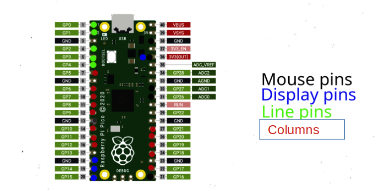

# Simple docs
This image has the pinout selected to solder the wires.

Important links to make things easy.

&nbsp; https://nerdcave.xyz/docs/tutorials/joystick-mouse/

&nbsp; https://github.com/KMKfw/kmk_firmware/blob/main/docs/en/Getting_Started.md

&nbsp; https://github.com/KMKfw/kmk_firmware/blob/main/docs/en/layers.md
